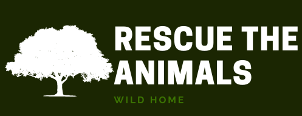

# AnimalONG
 

Um site que tem como objetivo replicar uma página de uma ONG de resgate de animais silvestres, onde os usuários podem apadrinhar os animais. Também tem uma área para o administrador do site poder adicionar, editar e deletar os animais.
<br><br/>
## Índice

- <a href=#funcionalidades>Funcionalidades do Projeto</a>
- <a href=#layout>Layout</a>
- <a href=#rodar>Como rodar o projeto</a>
- <a href=#tecnologias-utilizadas>Tecnologias Utilizadas</a>
- <a href=#autor>Autor</a>
- <a href=#proximos-passos>Próximos Passos</a>
<br><br/>
## ⚙️Funcionalidades 

- [x] Cadastro de Usuário
- [x] Login
- [x] Edição de Usuário
- [x] Área para administrador 
- [x] Cadastro do Animal
- [x] Edição do Animal
- [x] Exclusão do Animal
- [x] Apadrinhamento do Animal através do Usuário Logado
<br><br/>
## 🎨Layout
<br><br/>


<br><br/>

## 🚀 Rodando o projeto

``` bash
# Clone este repositório
$ git clone git@github.com:VICTOR-AZZOLINI-DEV/AnimalONG.git

# Acesse a pasta do projeto no terminal/cmd
$ cd AnimalONG

# Instale as dependências
$ npm install

# Execute a aplicação em modo de desenvolvimento
$ npm run dev

# O servidor inciará na porta:3000 - acesse http://localhost:3000 

```

## 🔧 Tecnologias Utilizadas

1. [Next.js](https://nextjs.org/)
2. [React](https://react.dev/)
3. [Chakra UI](https://chakra-ui.com/)
4. [Prisma](https://www.prisma.io/)
5. [MongoDB](https://www.mongodb.com/)
6. [Axios](https://axios-http.com/ptbr/docs/intro)
7. [Next-Auth](https://next-auth.js.org/)

## 🦸 Autor

<table>
  <tr>
    <td align="center">
      <a href="https://github.com/VICTOR-AZZOLINI-DEV">
        <br>
        <sub>
          <b>Victor Azzolini</b>
        </sub>
      </a>
    </td>
  </tr>
</table>


## 🔜 Próximos Passos

- [ ] Organização da API  

